# Moodie - Mood Tracking Application

## Overview
Moodie is an open-source and self-hostable mood tracker with a plethora of features that work with and for you.
It’s currently being developed by 2 software engineering students for a school project, but we plan on making it a fully-featured application. 
It’s privacy-oriented, secure, and incredibly easy to use, but don’t trust us, just follow me.
## Features
- 📅 Daily mood logging 
- 📊 Mood history visualization (charts/graphs)
- ✏️ Optional journaling with each mood entry
- 📤 Data export functionality
- 📱 Responsive design for mobile and desktop

## Screenshots

### Home View
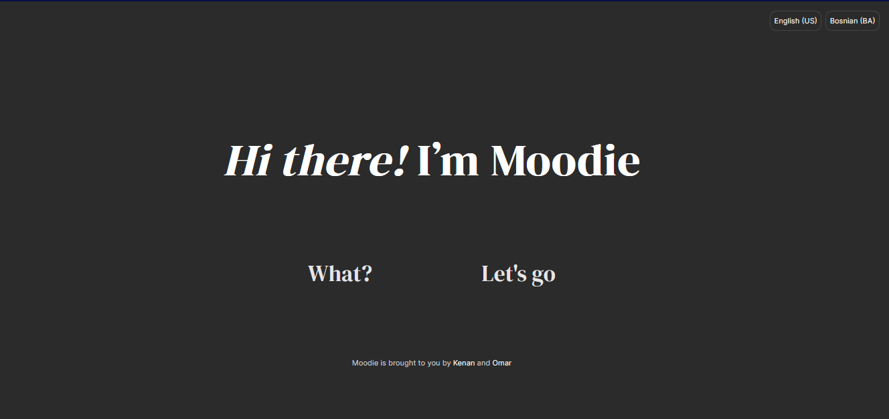
*First page that you see*

### About View
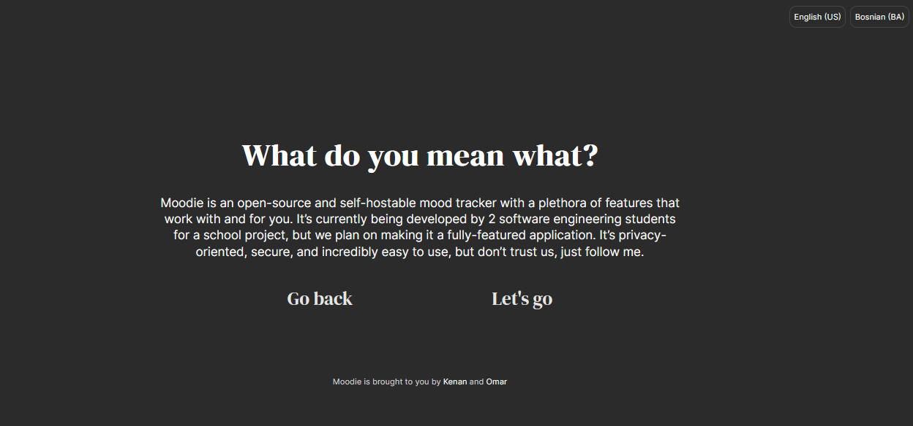
*Some info about moodie*

### Dashboard View
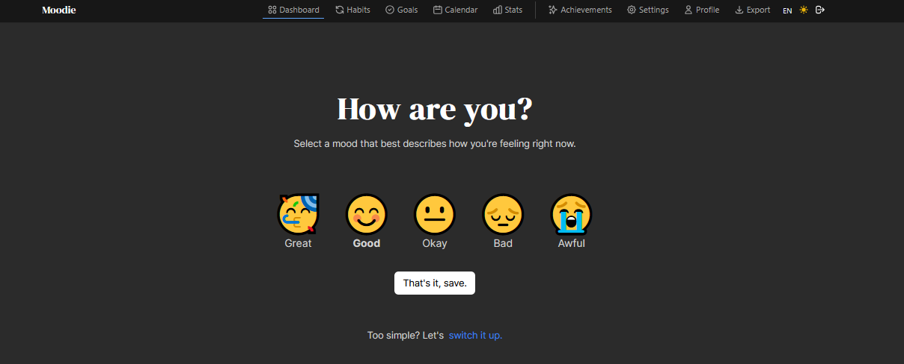
*Main dashboard with mood selector*

### Calendar View
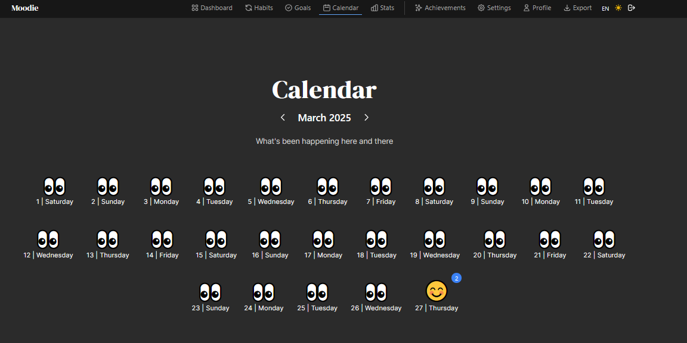
*Visualization of mood history over time*

### Daily View
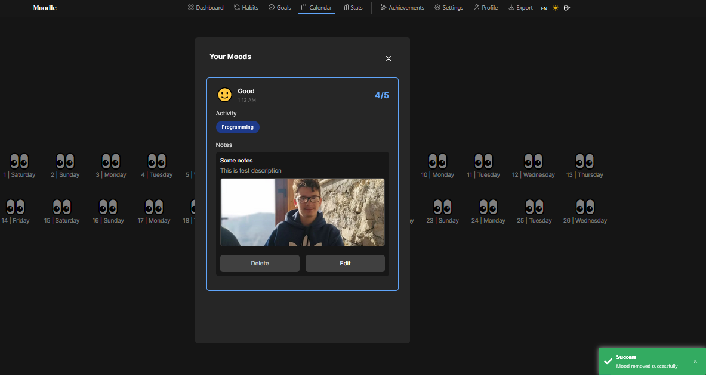
*Visualization of daily mood and notes*

### Goals View
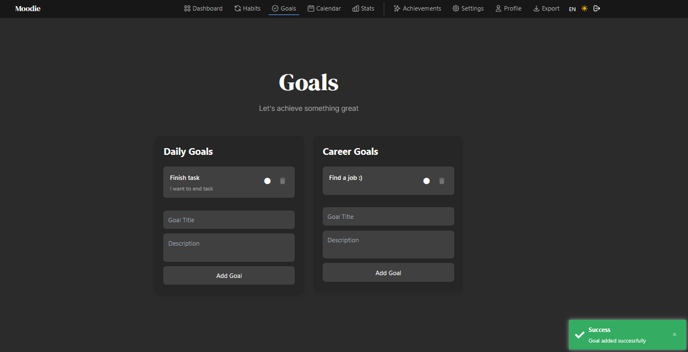
*Visualization of goals*

### Habits View
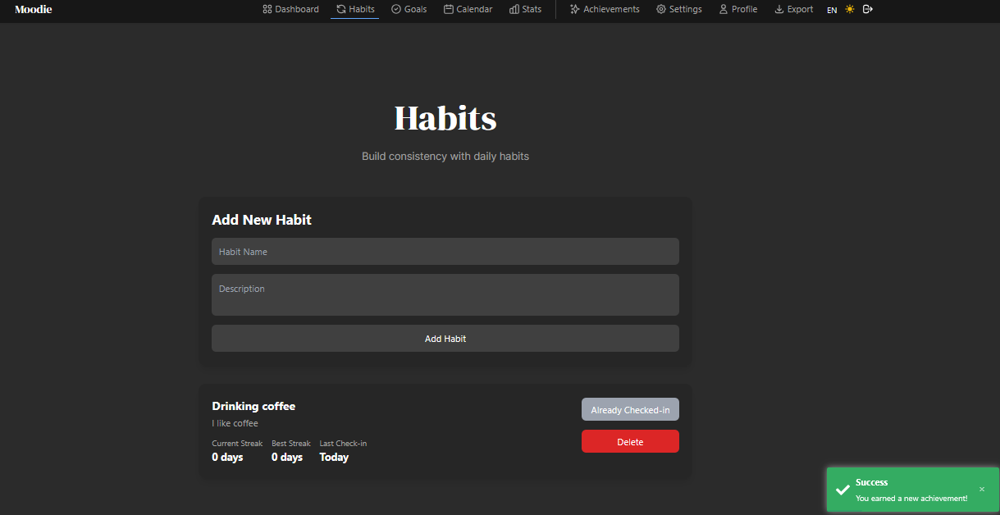
*Visualization of habits*

### Stats View
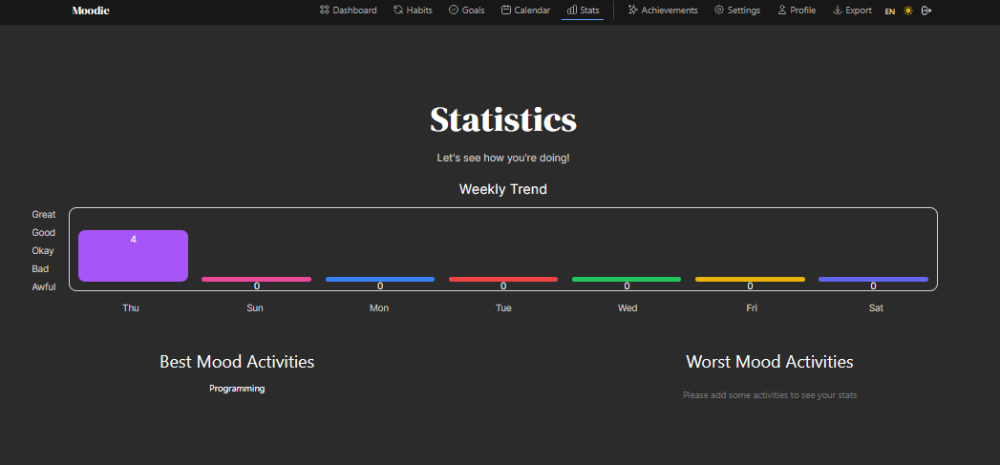
*Visualization of weekly stats*

### Achievements View
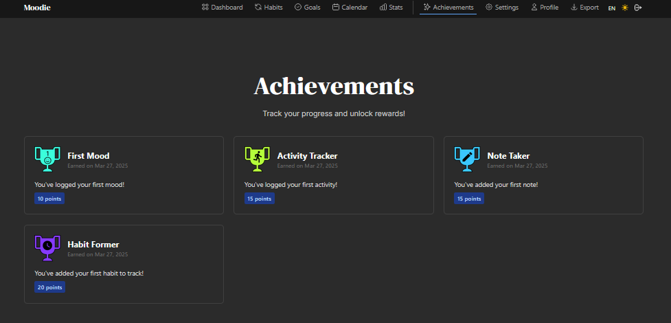
*Visualization of achievements*

### Settings View
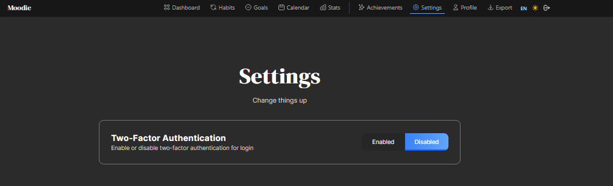
*Application settings*

### Profile View
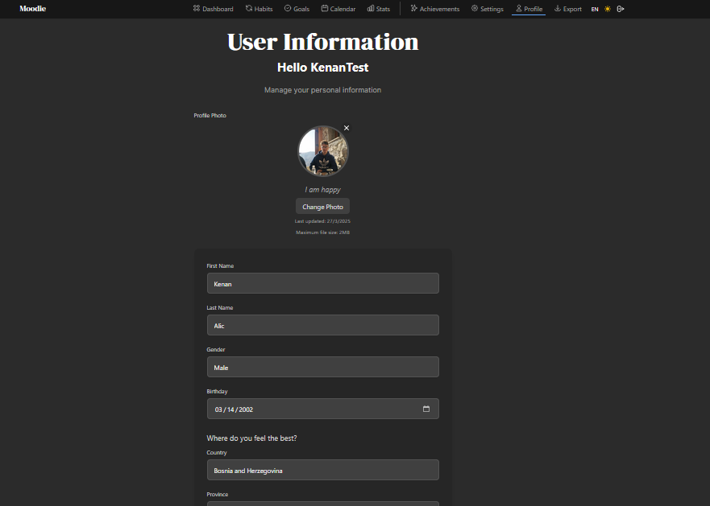
*Visualization of user profile*

### Export View
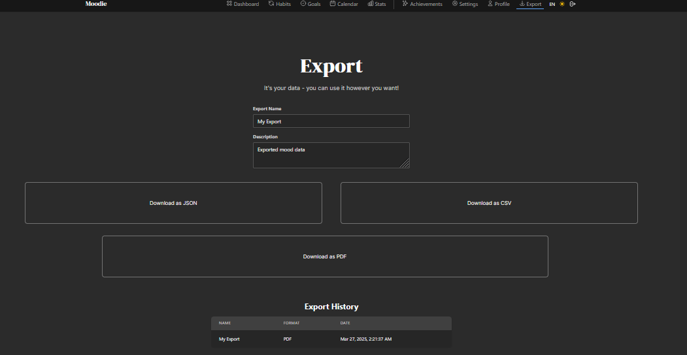
*Place where you can export your data*

## Technologies
Frontend: Angular
Backend: .Net
Styling: Tailwind CSS

## Installation
```bash
git clone https://github.com/kenanalic20/Moodie.git
cd Moodie
npm install
npm start
